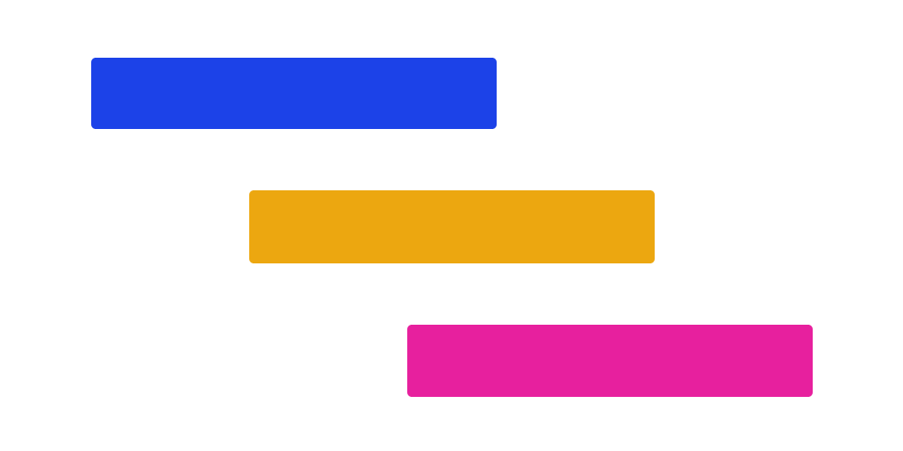

# XGantt (vue2版本)



 

[[English](./README.md)] [[中文](./README_cn.md)]

基于 vue2 的高性能甘特组件。

#### `vue3` 版本请移步 [这里](https://github.com/xpyjs/gantt)

## vue2 使用问题，使用前阅读，特别重要

********************************

`vue2.6.x` 与 `vue2.7.x` 版本不兼容。

- #### 如果使用 `vue2.6.14` 开发

由于 npm 升级机制原因，请修改依赖版本为固定：

```json
"vue": "2.6.14",
"vue-template-compiler": "2.6.14"
```

然后，请安装 1.x 版本的本项目 `@xpyjs/gantt-vue2@1`。

以上，能够解决初始化报错问题，详见 [ISSUE](https://github.com/xpyjs/gantt-vue2/issues/5)

- #### 如果使用 `vue2.7.x` 开发

请安装 2.x 版本的本项目内容，`@xpyjs/gantt-vue2@2`。当然，默认安装最新版本。

********************************

## 十分重要

这个库是 `jz-gantt` 的 vue2 版本的继承库。如果您之前已经使用了 `jz-gantt`，则需要仔细阅读如下内容。

**说明：**

> - `jz-gantt` vue2 版本（v0.0.17）已经被弃用。
> - 本项目完全重写。基于 `vue3` 代码，支持内容到 `1.3.1`，但不再更新内容，只做基本维护。如需更新内容，请使用 vue3 版本，或者自行更新。
> - 另外，如果您 fork 并提交了代码，我检测后会合并到主分支，并更新版本内容。

### 如何迁移

1. 包名不同， `@xpyjs/gantt-vue2` 替换了 `jz-gantt`。
2. 所有以 `j-` 或 `J` 的前缀全都更新为 `x-` 或 `X`。

除此之外，无需其他改动。

## 截图


## 什么是 XGantt

- [x] 自定义表格内容
- [x] 自定义甘特内容
- [x] 自定义表头
- [x] 动态渲染数据
- [x] 自定义样式

## 如何使用

### 安装

```bash
npm install @xpyjs/gantt-vue2 --save

// or
yarn add @xpyjs/gantt-vue2
```

### 使用

```js
import Vue from "vue";
import XGantt from "@xpyjs/gantt-vue2";
import '@xpyjs/gantt-vue2/lib/index.css';

Vue.use(XGantt);
```

## 文档

查看源码 [Github](http://github.com/xpyjs/gantt-vue2)

查看文档 [document web](https://docs.xiaopangying.com/gantt/docs/vue2)

### 基础用法

数据应当是一个数组。其中， `index`, `startDate`, `endDate` 和 `children` 是必须的选项，它们会帮助甘特图正确渲染。

```js
const dataList = [
    {
        index: 1,
        startDate: "2020-06-05",
        endDate: "2020-08-20",
        ttt: {
            a: "aaa",
            b: "bbb"
        },
        name: "mydata1",
        children: []
    },
    {
        index: 2,
        startDate: "2020-07-07",
        endDate: "2020-09-11",
        ttt: {},
        name: "mydata2",
        children: [
            {
                index: 3,
                startDate: "2020-07-10",
                endDate: "2020-08-15",
                ttt: {
                    a: "aaa"
                },
                name: "child1",
                children: []
            }
        ]
    }
];
```

```html
<x-gantt
    data-index="index"
    :data="dataList"
/>
```

### 使用列组件

内置了一个列组件，名为 `XGanttColumn`。其中，`label` 属性是必须的，它的值应当对应 `data` 中的字段名（支持深度查询），这会告诉组件渲染那一列内容。

```html
<x-gantt
    data-index="index"
    :data="dataList"
>
    <x-gantt-column label="index" />
</x-gantt>
```

### 使用甘特组件

内置了一个甘特组件，名为 `XGanttSlider`。

> 需要注意，只有一个甘特组件会被渲染，如果传入多个，则只有最后一个组件会被渲染。

```html
<x-gantt
    data-index="index"
    :data="dataList"
>
    <x-gantt-slider />  <!-- no render -->
    <x-gantt-slider />  <!-- will be rendered -->
</x-gantt>
```

## 与 vue3 版本的区别

- 悬停 slider 时，日期不会高亮
- 不允许拖拽 slider 上的进度值

## License

MIT
